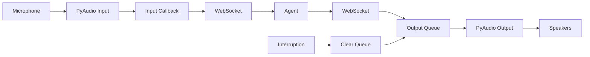

## Overview

The `AudioInterface` provides an abstraction for handling audio input and output in conversations. The SDK includes `DefaultAudioInterface`, a PyAudio-based implementation for real-time audio streaming.

## DefaultAudioInterface

The built-in audio interface for capturing microphone input and playing agent responses:

```python
from elevenlabs.conversational_ai.default_audio_interface import DefaultAudioInterface
from elevenlabs.conversational_ai.conversation import Conversation
from elevenlabs.client import ElevenLabs

elevenlabs = ElevenLabs(api_key="YOUR_API_KEY")

# Create audio interface
audio_interface = DefaultAudioInterface()

# Use in conversation
conversation = Conversation(
    client=elevenlabs,
    agent_id="your-agent-id",
    requires_auth=True,
    audio_interface=audio_interface,
)

conversation.start_session()
```

<Note>
  `DefaultAudioInterface` requires PyAudio. Install it with: `pip install pyaudio`
</Note>

## Audio Specifications

The audio interface uses the following format:

<ParamField path="Format" type="16-bit PCM">
  Audio format for input and output
</ParamField>

<ParamField path="Channels" type="Mono (1)">
  Single channel audio
</ParamField>

<ParamField path="Sample Rate" type="16kHz">
  16,000 samples per second
</ParamField>

<ParamField path="Input Buffer" type="4000 samples">
  250ms of audio per input chunk
</ParamField>

<ParamField path="Output Buffer" type="1000 samples">
  62.5ms of audio per output chunk
</ParamField>

## How It Works

### Input Flow

1. Microphone captures user audio via PyAudio callback
2. Audio is passed to `input_callback` provided by the Conversation
3. Audio is encoded and sent to the agent via WebSocket

### Output Flow

1. Agent sends audio chunks via WebSocket
2. Audio is queued in a thread-safe output queue
3. Background thread writes audio to PyAudio output stream
4. Audio plays through speakers/headphones

### Interruption Handling

When the user interrupts the agent:

1. Conversation detects interruption event
2. `interrupt()` is called on the audio interface
3. Output queue is cleared to stop current playback
4. New agent response starts playing



## Custom Audio Interface

Implement your own audio interface by subclassing `AudioInterface`:

```python
from elevenlabs.conversational_ai.conversation import AudioInterface
import queue
import threading

class CustomAudioInterface(AudioInterface):
    def __init__(self):
        self.output_queue = queue.Queue()
        self.should_stop = threading.Event()
    
    def start(self, input_callback):
        """Start capturing audio and set up output.
        
        Args:
            input_callback: Function to call with audio bytes (16-bit PCM, 16kHz, mono)
        """
        self.input_callback = input_callback
        
        # Start your audio input capture
        self._start_input_capture()
        
        # Start output playback thread
        self.output_thread = threading.Thread(target=self._output_loop)
        self.output_thread.start()
    
    def stop(self):
        """Stop audio capture and playback."""
        self.should_stop.set()
        self._stop_input_capture()
        self.output_thread.join()
    
    def output(self, audio: bytes):
        """Queue audio bytes for playback.
        
        Args:
            audio: Audio bytes in 16-bit PCM, 16kHz, mono format
        """
        self.output_queue.put(audio)
    
    def interrupt(self):
        """Clear queued audio to stop playback."""
        # Clear the queue
        while not self.output_queue.empty():
            try:
                self.output_queue.get_nowait()
            except queue.Empty:
                break
    
    def _start_input_capture(self):
        # Implement your input capture logic
        # Call self.input_callback(audio_bytes) with captured audio
        pass
    
    def _stop_input_capture(self):
        # Stop input capture
        pass
    
    def _output_loop(self):
        # Play queued audio
        while not self.should_stop.is_set():
            try:
                audio = self.output_queue.get(timeout=0.25)
                self._play_audio(audio)
            except queue.Empty:
                continue
    
    def _play_audio(self, audio: bytes):
        # Implement audio playback
        pass
```

### AudioInterface Methods

<ResponseField name="start" type="method" required>
  Called once before conversation starts. Set up audio capture and playback.
  
  ```python
  def start(self, input_callback: Callable[[bytes], None]):
      pass
  ```
  
  **Parameters:**
  - `input_callback`: Function to call with captured audio chunks (16-bit PCM, 16kHz, mono)
</ResponseField>

<ResponseField name="stop" type="method" required>
  Called once after conversation ends. Clean up all audio resources.
  
  ```python
  def stop(self):
      pass
  ```
</ResponseField>

<ResponseField name="output" type="method" required>
  Called with audio bytes to play. Should return quickly without blocking.
  
  ```python
  def output(self, audio: bytes):
      pass
  ```
  
  **Parameters:**
  - `audio`: Audio bytes in 16-bit PCM, 16kHz, mono format
</ResponseField>

<ResponseField name="interrupt" type="method" required>
  Called when user interrupts. Stop current playback immediately.
  
  ```python
  def interrupt(self):
      pass
  ```
</ResponseField>

## Async Audio Interface

For async workflows, use `AsyncAudioInterface`:

```python
import asyncio
from elevenlabs.conversational_ai.conversation import AsyncAudioInterface

class CustomAsyncAudioInterface(AsyncAudioInterface):
    async def start(self, input_callback):
        """Start audio capture.
        
        Args:
            input_callback: Async function to call with audio bytes
        """
        self.input_callback = input_callback
        # Start async audio capture
        await self._start_capture()
    
    async def stop(self):
        """Stop audio capture and playback."""
        await self._stop_capture()
    
    async def output(self, audio: bytes):
        """Queue audio for playback."""
        await self.output_queue.put(audio)
    
    async def interrupt(self):
        """Clear audio queue."""
        while not self.output_queue.empty():
            try:
                self.output_queue.get_nowait()
            except asyncio.QueueEmpty:
                break
```

Use with `AsyncConversation`:

```python
from elevenlabs.client import AsyncElevenLabs
from elevenlabs.conversational_ai.conversation import AsyncConversation
from elevenlabs.conversational_ai.default_audio_interface import AsyncDefaultAudioInterface

elevenlabs = AsyncElevenLabs(api_key="YOUR_API_KEY")

async def main():
    audio_interface = AsyncDefaultAudioInterface()
    
    conversation = AsyncConversation(
        client=elevenlabs,
        agent_id="your-agent-id",
        requires_auth=True,
        audio_interface=audio_interface,
    )
    
    await conversation.start_session()
    await asyncio.sleep(30)  # Run for 30 seconds
    await conversation.end_session()

asyncio.run(main())
```

## File-Based Audio Interface

Example: Read from a file instead of microphone:

```python
import wave
import queue
import threading
from elevenlabs.conversational_ai.conversation import AudioInterface

class FileAudioInterface(AudioInterface):
    def __init__(self, input_file: str, output_file: str):
        self.input_file = input_file
        self.output_file = output_file
        self.output_queue = queue.Queue()
        self.should_stop = threading.Event()
    
    def start(self, input_callback):
        # Read from input file
        def read_input():
            with wave.open(self.input_file, 'rb') as wf:
                chunk_size = 4000 * 2  # 4000 samples * 2 bytes per sample
                while not self.should_stop.is_set():
                    data = wf.readframes(4000)
                    if not data:
                        break
                    input_callback(data)
        
        self.input_thread = threading.Thread(target=read_input)
        self.input_thread.start()
        
        # Write to output file
        self.output_wf = wave.open(self.output_file, 'wb')
        self.output_wf.setnchannels(1)
        self.output_wf.setsampwidth(2)
        self.output_wf.setframerate(16000)
        
        self.output_thread = threading.Thread(target=self._output_loop)
        self.output_thread.start()
    
    def stop(self):
        self.should_stop.set()
        self.input_thread.join()
        self.output_thread.join()
        self.output_wf.close()
    
    def output(self, audio: bytes):
        self.output_queue.put(audio)
    
    def interrupt(self):
        while not self.output_queue.empty():
            try:
                self.output_queue.get_nowait()
            except queue.Empty:
                break
    
    def _output_loop(self):
        while not self.should_stop.is_set():
            try:
                audio = self.output_queue.get(timeout=0.25)
                self.output_wf.writeframes(audio)
            except queue.Empty:
                continue

# Usage
audio_interface = FileAudioInterface(
    input_file="user_audio.wav",
    output_file="agent_audio.wav"
)

conversation = Conversation(
    client=elevenlabs,
    agent_id="your-agent-id",
    requires_auth=True,
    audio_interface=audio_interface,
)
```

## Troubleshooting

<AccordionGroup>
  <Accordion title="PyAudio installation errors">
    If you encounter errors installing PyAudio:
    
    **macOS:**
    ```bash
    brew install portaudio
    pip install pyaudio
    ```
    
    **Ubuntu/Debian:**
    ```bash
    sudo apt-get install portaudio19-dev
    pip install pyaudio
    ```
    
    **Windows:**
    Download the appropriate wheel from [PyPI](https://www.lfd.uci.edu/~gohlke/pythonlibs/#pyaudio)
  </Accordion>
  
  <Accordion title="No audio input/output">
    Check that your system has a default microphone and speakers configured:
    
    ```python
    import pyaudio
    
    p = pyaudio.PyAudio()
    print(f"Input devices: {p.get_default_input_device_info()}")
    print(f"Output devices: {p.get_default_output_device_info()}")
    p.terminate()
    ```
  </Accordion>
  
  <Accordion title="Audio latency issues">
    Reduce buffer sizes for lower latency (at the cost of potential audio glitches):
    
    ```python
    class LowLatencyAudioInterface(DefaultAudioInterface):
        INPUT_FRAMES_PER_BUFFER = 2000   # 125ms
        OUTPUT_FRAMES_PER_BUFFER = 500   # 31.25ms
    ```
  </Accordion>
  
  <Accordion title="Audio quality issues">
    Ensure your audio is in the correct format:
    - 16-bit PCM (not 8-bit or 32-bit float)
    - 16kHz sample rate (not 44.1kHz or 48kHz)
    - Mono (not stereo)
    
    Convert if needed:
    ```python
    import numpy as np
    
    # Convert stereo to mono
    stereo_audio = np.frombuffer(audio_bytes, dtype=np.int16)
    mono_audio = stereo_audio.reshape(-1, 2).mean(axis=1).astype(np.int16)
    
    # Resample from 44.1kHz to 16kHz (requires scipy)
    from scipy import signal
    resampled = signal.resample(audio_array, int(len(audio_array) * 16000 / 44100))
    ```
  </Accordion>
</AccordionGroup>

## Best Practices

<CardGroup cols={2}>
  <Card title="Buffer Management" icon="layer-group">
    Use appropriate buffer sizes. Smaller buffers reduce latency but increase CPU usage and potential glitches.
  </Card>
  <Card title="Thread Safety" icon="lock">
    Use thread-safe queues for audio output. PyAudio callbacks run in separate threads.
  </Card>
  <Card title="Error Handling" icon="triangle-exclamation">
    Handle audio device errors gracefully. Devices can disconnect or change during a session.
  </Card>
  <Card title="Resource Cleanup" icon="broom">
    Always clean up audio resources in `stop()` to prevent memory leaks and device locks.
  </Card>
</CardGroup>
