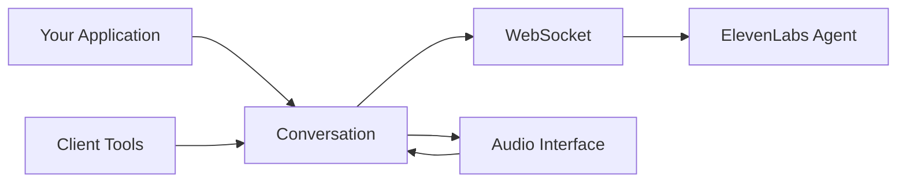

## Introduction

ElevenAgents is ElevenLabs' conversational AI framework that enables you to build interactive AI agents with real-time audio capabilities. Create voice-enabled agents that can have natural conversations, call custom tools, and provide seamless audio experiences.

## Key Features

<CardGroup cols={2}>
  <Card title="Real-Time Audio" icon="microphone">
    Full-duplex audio conversations with low-latency voice input and output
  </Card>
  <Card title="Custom Tools" icon="wrench">
    Register synchronous and asynchronous tools that agents can call during conversations
  </Card>
  <Card title="Event Callbacks" icon="bell">
    Rich callbacks for agent responses, user transcripts, and latency measurements
  </Card>
  <Card title="Flexible Configuration" icon="sliders">
    Customize conversation config, dynamic variables, and platform settings
  </Card>
</CardGroup>

## Quick Start

Here's a minimal example to get started with ElevenAgents:

```python
from elevenlabs.client import ElevenLabs
from elevenlabs.conversational_ai.conversation import Conversation
from elevenlabs.conversational_ai.default_audio_interface import DefaultAudioInterface

elevenlabs = ElevenLabs(
  api_key="YOUR_API_KEY",
)

# Create audio interface for real-time audio input/output
audio_interface = DefaultAudioInterface()

# Create conversation
conversation = Conversation(
    client=elevenlabs,
    agent_id="your-agent-id",
    requires_auth=True,
    audio_interface=audio_interface,
)

# Start the conversation
conversation.start_session()

# The conversation runs in background until you call:
conversation.end_session()
```

## Core Components

### Conversation

The `Conversation` class manages the WebSocket connection to your agent and handles the conversation lifecycle. It supports both synchronous and asynchronous implementations.

<Card title="Learn More" icon="arrow-right" href="/conversational-ai/conversations">
  Explore conversation management and callbacks
</Card>

### Audio Interface

The `AudioInterface` provides an abstraction for handling audio input and output. The SDK includes `DefaultAudioInterface` which uses PyAudio for real-time audio streaming.

<Card title="Learn More" icon="arrow-right" href="/conversational-ai/audio-interface">
  Learn about audio interfaces and custom implementations
</Card>

### Client Tools

`ClientTools` allows you to register custom functions that your AI agent can call during conversations, supporting both sync and async operations.

<Card title="Learn More" icon="arrow-right" href="/conversational-ai/tools">
  Discover how to register and use tools
</Card>

### Agents API

Create, manage, and configure AI agents using the Agents API. Define conversation behavior, platform settings, and workflows.

<Card title="Learn More" icon="arrow-right" href="/conversational-ai/agents">
  Read the Agents API reference
</Card>

## Architecture

ElevenAgents uses a WebSocket-based architecture for real-time bidirectional communication:



1. **Audio Interface** captures user audio and plays agent responses
2. **Conversation** manages the WebSocket connection and message handling
3. **Client Tools** execute custom functions when called by the agent
4. **Agent** processes audio, generates responses, and calls tools as needed

## Next Steps

<CardGroup cols={2}>
  <Card title="Create an Agent" icon="robot" href="/conversational-ai/agents">
    Learn how to create and configure AI agents
  </Card>
  <Card title="Start Conversations" icon="comments" href="/conversational-ai/conversations">
    Manage conversation sessions and callbacks
  </Card>
  <Card title="Register Tools" icon="wrench" href="/conversational-ai/tools">
    Add custom functionality to your agents
  </Card>
  <Card title="Audio Setup" icon="volume" href="/conversational-ai/audio-interface">
    Configure audio input and output
  </Card>
</CardGroup>
